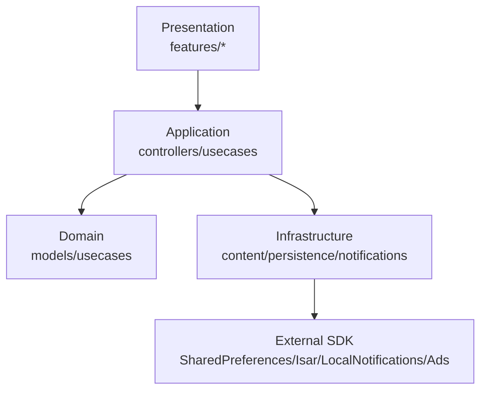

# OurMatchWellFlutter 기술 아키텍처/품질 보고서 (ISO 기준)

| 항목 | 값 |
|---|---|
| 프로젝트 | OurMatchWellFlutter |
| 문서 파일 | `techfile.md` |
| 기준 브랜치 | `codex/iso-techfile-doc` |
| 기준 경로 | `/Users/jaebinchoi/Desktop/OurMatchWellFlutter` |
| 작성일 | 2026-02-21 |
| 적용 표준 | ISO 9001, ISO/IEC 25010, ISO/IEC 12207 |

---

## 1. 요구사항 정의서

### 1.1 목적
본 문서는 현행 Flutter MVP 코드베이스를 대상으로, ISO 심사 관점에서 요구사항-설계-검증-유지보수까지 추적 가능한 기술 기준선을 정의한다.

### 1.2 제품 범위

| 구분 | 내용 |
|---|---|
| 제품 목적 | 한국어 사용자가 영어권 파트너와의 실전 대화를 빠르게 이어가도록 지원 |
| 핵심 가치 | 매일 문장 3개 + 패턴 3개, 빠른 복습 루프, 낮은 사용 마찰 |
| 플랫폼 | Flutter(Android/iOS) |
| 배포 형태 | 모바일 앱 (Google Play Internal/Release Workflow 존재) |

### 1.3 범위 정의 (In / Out)

| 구분 | 포함(필수) | 제외(의도적) |
|---|---|---|
| 기능 | 온보딩, Today/Explore/My Library, Sentence Detail 전송모드, 리마인더, Appearance 모드 | 프리미엄/결제/구독/페이월 |
| 데이터 | 로컬 콘텐츠(JSON), SharedPreferences, Isar, 파일 캐시 | 원격 AI 대화 API, 원격 manifest 실동기화 |
| 운영 | CI(Analyze/Test), Release(AAB 업로드) | 서버 백엔드 운영 |

### 1.4 이해관계자

| 역할 | 책임 |
|---|---|
| Product Owner | MVP 범위/정책 승인 (free-only) |
| Flutter Engineer | 기능 구현/회귀 방지/테스트 |
| QA | 기능 보존성, 상태(loading/empty/error), 테마 검증 |
| Release Manager | 서명/시크릿/스토어 업로드 점검 |

### 1.5 요구사항 목록 (추적 ID)

| ID | 요구사항 | 유형 | 수용 기준 |
|---|---|---|---|
| FR-01 | 온보딩 다단계 + 건너뛰기/완료 | 기능 | 온보딩 완료 후 재진입 시 Today로 라우팅 |
| FR-02 | 3탭 구조 유지(Today/Explore/My) | 기능 | `StatefulShellRoute.indexedStack` 기반 내비게이션 정상 |
| FR-03 | Sentence Send Mode (톤/복사/공유) | 기능 | Natural/Softer/More direct 변환 및 복사/공유 동작 |
| FR-04 | Daily Review Reminder | 기능 | 토글/시간설정/권한거부 처리/재스케줄 정상 |
| FR-05 | Appearance(System/Light/Dark) | 기능 | 설정 변경 즉시 테마 반영 + 재실행 후 유지 |
| NFR-01 | 확장성/유지보수성 우선 구조 | 품질 | 계층 분리, 의존성 역전, 변경영향 최소화 |
| NFR-02 | 테스트 가능 구조 | 품질 | 핵심 유스케이스/컨트롤러 테스트 존재 |
| NFR-03 | 보안/비밀정보 분리 | 보안 | 키스토어/시크릿 비커밋, 환경변수 주입 |
| NFR-04 | 성능 저하 방지 | 성능 | 캐시 사용, 선택 알고리즘 결정론적, 과도한 재계산 방지 |

### 1.6 ISO 표준 적용 매핑

| 표준 | 적용 지점 | 증빙 산출물 |
|---|---|---|
| ISO 9001 | 요구사항 추적, 변경관리, 검증 기록 | 본 문서 1~10장, CI 로그 |
| ISO/IEC 25010 | 기능적합성/신뢰성/보안성/유지보수성/이식성 점검 | 6장 예외정책, 7장 테스트, 9장 검증리포트 |
| ISO/IEC 12207 | 개발 생명주기(요구-설계-구현-검증-유지보수) 정렬 | 본 문서 섹션 순서 전체 |

설명:
- 본 문서는 ISO 9001의 문서화된 프로세스 요구를 충족하도록, 요구사항 ID 기반 추적성을 제공한다.
- ISO/IEC 25010 품질 특성은 기능/테스트/예외/보안 항목으로 분해했다.
- ISO/IEC 12207 관점에서 실제 개발 단계 산출물을 한 문서 내 연결했다.

---

## 2. 기능 명세서

### 2.1 화면/플로우 기능 명세

| 기능 ID | 화면/모듈 | 상세 동작 | 상태 |
|---|---|---|---|
| FR-01 | Onboarding | PageView 3단계, Skip, Complete 저장 | 구현됨 |
| FR-02 | App Shell | Today/Explore/My 탭 유지, 라우팅 가드 | 구현됨 |
| FR-03 | Sentence Detail | 톤 변환(결정론), 클립보드 복사, 시스템 공유 | 구현됨 |
| FR-04 | Settings/Reminder | 토글, 시간 선택, 권한 거부 비차단 안내, 스케줄 동기화 | 구현됨 |
| FR-05 | Settings/Appearance | System/Light/Dark 선택 및 영속화 | 구현됨 |
| FR-06 | State Coverage | loading/empty/error 카드 컴포넌트 제공 | 구현됨 |

### 2.2 수용 기준(예시)

| 케이스 | 입력 | 기대 결과 |
|---|---|---|
| AC-01 | 앱 첫 실행 -> 온보딩 Skip | 온보딩 완료 저장 + Today 진입 |
| AC-02 | Sentence Tone = Softer | 정중 표현 규칙 변환 결과 반환 |
| AC-03 | Reminder On + 권한 거부 | 앱 크래시 없음, 안내 메시지 출력, 스케줄 취소 |
| AC-04 | Appearance Dark 선택 | 즉시 Dark Theme 적용 + 재시작 후 유지 |

설명:
- 기능 명세는 기존 사용자 여정 보존을 전제로 한다.
- free-only MVP 정책에 따라 결제/구독 관련 UX는 범위에서 제외한다.

---

## 3. 시스템 아키텍처 설계

### 3.1 아키텍처 원칙

| 원칙 | 적용 방식 |
|---|---|
| SOLID-S | UseCase/Controller/Repository 책임 분리 |
| SOLID-O | 톤 규칙/알림 클라이언트 교체 가능한 확장점 제공 |
| SOLID-L | 알림 클라이언트 인터페이스 구현체 교체 가능 |
| SOLID-I | 설정/알림/콘텐츠 인터페이스 분리 |
| SOLID-D | UI는 Provider를 통해 추상화 의존 |

### 3.2 레이어 구조



### 3.3 모듈 책임 분해

| 레이어 | 주요 파일 | 책임 |
|---|---|---|
| Presentation | `lib/features/*` | 화면 렌더링, 사용자 상호작용 |
| App | `lib/app/app.dart`, `lib/app/router.dart` | 앱 부트스트랩, 라우팅, 테마 결합 |
| Domain | `lib/domain/usecases/*` | 비즈니스 규칙(오늘팩, 전송모드) |
| Infrastructure | `lib/core/*` | 데이터 로딩/저장/알림/로깅/설정 |

### 3.4 의존성 규칙

```text
UI -> UseCase/Controller -> Repository/Store -> Platform SDK
UI must not call platform SDK directly.
```

설명:
- 현재 코드베이스는 Riverpod 기반 DI를 통해 테스트 대역(fakes/mocks) 주입이 용이하다.
- Bootstrappers(`Ads`, `ReviewReminder`)는 부수효과를 분리하여 화면 컴포넌트의 순수성을 높인다.

---

## 4. 데이터 구조 설계

### 4.1 도메인 모델

| 엔티티 | 필드(핵심) | 용도 |
|---|---|---|
| Sentence | `id`, `english`, `korean`, `tags`, `tone` | 문장 추천/검색/상세 |
| Pattern | `id`, `title`, `exampleEnglish`, `tags`, `tip` | 패턴 학습 |
| ReviewState | `dueAtEpochMs`, `intervalDays` | 복습 큐 간격 관리 |
| TodayPack | curated 1 + extras 2 + patterns 3 | 일일 추천 묶음 |

### 4.2 영속화 스키마

| 저장소 | 키/컬렉션 | 설명 |
|---|---|---|
| SharedPreferences | `onboarding_completed`, `appearance_mode`, `review_reminder_*` 등 | 사용자 설정/상태 |
| Isar(AppMetaEntity) | 온보딩, 설치일, 마이그레이션 메타 | 상태 스냅샷 |
| Isar(FavoriteEntity) | `sentenceId` unique | 즐겨찾기 |
| Isar(StudyDayEntity) | `dayKey` unique | 스트릭 계산 |
| Isar(ReviewStateEntity) | `sentenceId`, `dueAtEpochMs` | 복습 큐 |
| Isar(CacheBlobEntity) | `key`, `value` | 캐시 데이터 |

### 4.3 환경변수/런타임 설정

| 키 | 목적 | 기본값 관리 |
|---|---|---|
| `ADMOB_USE_TEST_ADS` | 테스트 광고 전환 | `runtime_config.dart` |
| `ADMOB_BANNER_ID_ANDROID/IOS` | 배너 단위 ID | dart-define |
| `REVIEW_REMINDER_*` | 알림 ID/채널/문구/시간 | `review_reminder_config.dart` |
| `ADMOB_APP_ID`(Gradle property) | Android Manifest placeholder | release 빌드 강제 검증 |

설명:
- 하드코딩/매직넘버를 줄이기 위해 설정값은 상수/환경변수로 분리한다.
- 데이터 구조는 앱 재설치/마이그레이션/백필 시나리오를 고려해 key 기반으로 유지한다.

---

## 5. API 명세

> 본 프로젝트는 외부 HTTP API보다 **내부 모듈 API(UseCase/Controller/Store)**가 핵심이다.

### 5.1 내부 API 테이블

| API | 시그니처 | 입력 | 출력 | 오류/예외 |
|---|---|---|---|---|
| Theme 매핑 | `ThemeMode mapAppearanceModeToThemeMode(AppearanceMode mode)` | `system/light/dark` | `ThemeMode` | 없음 |
| Send Mode | `String textFor(String source, SentenceToneVariant variant)` | 원문, 톤 | 변환 문장 | 빈문자열 안전 처리 |
| Reminder 토글 | `Future<ReminderToggleResult> updateEnabled(bool enabled)` | On/Off | `enabled/disabled/permissionDenied` | 권한요청 실패 시 안전 실패 |
| Reminder 동기화 | `Future<void> syncCurrentSettings()` | 현재 prefs 상태 | 스케줄 반영 | 스케줄 실패 로깅 후 앱 지속 |
| Today Pack | `Future<TodayPack> getTodayPack({...})` | 날짜, 시나리오 태그 | 추천 묶음 | 데이터셋 깨짐 시 `StateError` |
| 설정 저장 | `void setAppearanceMode(AppearanceMode mode)` | 모드 | 저장/notify | 저장소 실패 시 기본 경로 유지 |

### 5.2 API 설계 규칙

| 규칙 | 설명 |
|---|---|
| 입력 검증 | 시간값(clamp), nullable 방어 |
| 결정론 보장 | 문장/패턴 선택은 seed 기반 |
| 실패 허용 전략 | 알림 스케줄 실패 시 앱 중단 금지, 로깅 중심 |
| 의존성 분리 | Notification Client 인터페이스로 플랫폼 구현 격리 |

### 5.3 코드 예시 (목적 주석 포함)

```dart
/// Coordinates reminder preferences, permissions, and scheduling actions.
class ReviewReminderController {
  /// Applies enable/disable request and keeps schedule state consistent.
  Future<ReminderToggleResult> updateEnabled(bool enabled) async {
    // ...
  }

  /// Persists reminder time and reschedules when reminders are active.
  Future<void> updateTime({required int hour, required int minute}) async {
    // ...
  }

  /// Reconciles persisted settings with platform reminder schedule.
  Future<void> syncCurrentSettings() async {
    // ...
  }
}
```

설명:
- 공개 함수는 "무엇을 보장하는지"가 드러나는 목적 주석을 필수로 유지한다.
- 내부 API를 명세화하면 회귀 테스트 범위와 리뷰 기준이 선명해진다.

---

## 6. 예외 처리 정책

### 6.1 예외 시나리오 분석

| 모듈 | 실패 지점 | 처리 정책 | 사용자 영향 |
|---|---|---|---|
| ContentStore | JSON 파싱 실패/최소건수 미달 | `StateError` 발생 + 상위 UI에서 error state 렌더 | 앱 크래시 대신 오류 카드 |
| Reminder 권한 | 권한 거부/요청 예외 | `permissionDenied` 반환, 스케줄 취소 | 비차단 안내 메시지 |
| Reminder 스케줄 | OS 스케줄 호출 실패 | 에러 로깅 후 계속 실행 | 기능 일부 실패, 앱 지속 |
| Preferences | 비정상 값(시간/모드) | clamp + fallback(system/default time) | 안전한 기본값 복귀 |
| 라우팅 | 온보딩 미완료 진입 | redirect(`/onboarding`) | 사용자 흐름 보정 |

### 6.2 로깅 정책

| 수준 | 사용 기준 | 예 |
|---|---|---|
| `debug` | 로컬 진단 정보 | 상태 전이 추적 |
| `info` | 정상 흐름 이벤트 | 초기화 완료 |
| `warning` | 계속 진행 가능 경고 | fallback 사용 |
| `error` | 기능 실패 | 스케줄/권한 요청 실패 |

### 6.3 보안 취약점 고려

| 항목 | 위험 | 대응 |
|---|---|---|
| 릴리즈 서명정보 | 키 유출 | 키스토어/GitHub Secrets 분리, 저장소 비커밋 |
| 광고 설정 | 테스트 ID 릴리즈 반영 | Gradle release task에서 강제 검증 |
| 개인정보 | 과도한 로깅 | release 모드 로깅 축소 + 오류 중심 출력 |

설명:
- 예외는 "복구 가능/불가능"로 분류하고, 사용자에게는 상태 카드/스낵바로 안전 노출한다.
- 시스템 실패를 앱 전체 실패로 확산시키지 않는 것이 기본 방침이다.

---

## 7. 테스트 케이스

### 7.1 테스트 전략

| 테스트 계층 | 목적 | 대표 파일 |
|---|---|---|
| Unit | 유스케이스/컨트롤러 순수 규칙 검증 | `test/sentence_send_mode_usecase_test.dart`, `test/review_reminder_controller_test.dart` |
| Persistence | 설정 영속성/기본값 검증 | `test/review_reminder_preferences_test.dart`, `test/appearance_preferences_test.dart` |
| Widget/Flow | 화면 상호작용/라우팅 보존 | `test/settings_appearance_interaction_test.dart`, `test/onboarding_flow_test.dart` |
| Smoke | 라우팅/반응형 회귀 탐지 | `test/router_smoke_test.dart`, `test/responsive_layout_smoke_test.dart` |

### 7.2 요구사항-테스트 추적 매트릭스

| 요구사항 ID | 테스트 케이스 | 기대 |
|---|---|---|
| FR-01 | `onboarding_flow_test.dart` | Skip/완료 후 라우팅 일치 |
| FR-03 | `sentence_send_mode_usecase_test.dart` | 톤 변환 규칙/결정론 일치 |
| FR-04 | `review_reminder_controller_test.dart` | 권한/스케줄/취소 동작 일치 |
| FR-05 | `appearance_*` + `settings_appearance_interaction_test.dart` | 모드 매핑/영속화/즉시반영 |

### 7.3 실행 명령

```bash
flutter analyze
flutter test -j 1
```

설명:
- 테스트는 기능 보존성(기존 플로우 불변)을 우선 목표로 한다.
- 컨트롤러/스토어는 인터페이스 추상화를 통해 mock/fake 주입이 가능하도록 유지한다.

---

## 8. 코드 구현

### 8.1 구현 원칙(강제 규칙)

| 규칙 | 구현 지침 |
|---|---|
| 하드코딩 금지 | 문자열/시간/ID는 상수 또는 설정 클래스로 분리 |
| 매직넘버 금지 | `review_reminder_config.dart`, 테마 토큰, spacing 상수 사용 |
| 중복 로직 금지 | 공통 변환/검증 로직을 UseCase/Helper로 집중 |
| 의존성 분리 | UI는 Provider로 의존성 주입, SDK 직접 호출 금지 |
| 로깅 포함 | 예외 가능 지점은 `AppLogger` 경유 로그 기록 |

### 8.2 참조 구현 스켈레톤 (함수 목적 주석 필수)

```dart
/// Provides a deterministic and testable send-mode transform service.
abstract class SendModeService {
  /// Returns transformed text for selected tone variant.
  String transform({required String source, required SentenceToneVariant tone});
}

/// Local implementation with no network dependency.
final class LocalSendModeService implements SendModeService {
  /// Applies deterministic rewrite rules and normalizes whitespace.
  @override
  String transform({required String source, required SentenceToneVariant tone}) {
    // Delegate to use case rule set.
    return source;
  }
}

/// Orchestrates reminder schedule synchronization.
final class ReminderOrchestrator {
  /// Re-schedules exactly one daily reminder based on persisted preferences.
  Future<void> rescheduleDailyReminder() async {
    // 1) read preferences
    // 2) validate/clamp inputs
    // 3) cancel existing id
    // 4) schedule new trigger
  }
}
```

### 8.3 코드 리뷰 체크리스트

| 체크 항목 | 확인 기준 |
|---|---|
| 함수 주석 | 모든 public 함수 목적 주석 존재 |
| 테스트 가능성 | 외부 의존성 인터페이스화 완료 |
| 예외 처리 | catch + logger + 사용자 피드백 분리 |
| 환경변수 | 플랫폼/배포 상수 코드 하드코딩 금지 |

설명:
- 구현 섹션은 신규 기능 추가 시 재사용 가능한 품질 게이트를 정의한다.
- OOP/SOLID 준수는 "클래스 책임 단일화 + 인터페이스 기반 의존"으로 강제한다.

---

## 9. 코드 검증 리포트

### 9.1 정적/동적 검증 결과

| 항목 | 명령 | 결과 |
|---|---|---|
| 정적 분석 | `flutter analyze` | PASS (`No issues found`) |
| 단위/위젯 테스트 | `flutter test -j 1` | PASS (`29 passed`) |

### 9.2 ISO/품질 모델 정합성 점검

| 품질 특성(ISO/IEC 25010) | 평가 | 근거 |
|---|---|---|
| Functional Suitability | 양호 | 핵심 기능 테스트 존재 |
| Reliability | 양호 | 예외 시 앱 지속 정책 + fallback |
| Usability | 양호 | 상태카드/설정 UI/테마 전환 제공 |
| Performance Efficiency | 보통~양호 | 캐시 및 결정론 선택, 추가 프로파일링 필요 |
| Security | 보통~양호 | 시크릿 분리/릴리즈 검증, 보안 로깅 개선 여지 |
| Maintainability | 양호 | 계층 분리, Provider DI, 테스트 코드 확보 |
| Portability | 양호 | Flutter 공통 코드 + 플랫폼 분기 |

### 9.3 성능 병목 가능성 분석

| 구간 | 잠재 병목 | 대응 권고 |
|---|---|---|
| 초기 로딩 시 JSON decode | 대용량 데이터 파싱 비용 | isolate 파싱/지연 로딩 고려 |
| 리스트 렌더링 | 긴 목록 빌드 비용 | pagination/virtualization 검토 |
| 리마인더 동기화 | 앱 재개 시 반복 sync | signature 기반 중복 방지 유지 |

### 9.4 잔여 리스크

| 리스크 | 영향 | 완화 계획 |
|---|---|---|
| 원격 콘텐츠 미구현 | 업데이트 유연성 저하 | manifest 네트워크 구현 시 계약 테스트 추가 |
| 광고 SDK 외부 의존 | 런타임 변동 | consent/ads 실패시 graceful fallback 유지 |

설명:
- 현재 코드베이스는 기능 보존성과 테스트 안정성 측면에서 양호하다.
- 성능/보안은 릴리즈 단계에서 프로파일링과 시크릿 감사 루틴으로 보강 가능하다.

---

## 10. 유지보수 가이드

### 10.1 변경관리 프로세스 (ISO 9001 aligned)

| 단계 | 활동 | 산출물 |
|---|---|---|
| 요구 접수 | 변경요청 ID 부여 | 변경요청서/이슈 |
| 영향 분석 | 기능/데이터/테스트 영향 범위 식별 | 영향 분석표 |
| 구현 | 브랜치 전략(`codex/*`) 준수 | 코드/문서 변경 |
| 검증 | analyze/test + 수동 QA | 검증 리포트 |
| 릴리즈 | CI/CD 통과 후 머지/배포 | 태그/릴리즈 노트 |

### 10.2 브랜치/릴리즈 정책

```bash
# 기능 브랜치 생성
git checkout -b codex/<feature-name>

# 품질 게이트
flutter analyze
flutter test -j 1

# main 머지 전 필수
# - 기능 보존 체크
# - free-only 정책 확인
# - 보안/시크릿 누락 점검
```

### 10.3 운영 점검 체크리스트

| 주기 | 점검 항목 |
|---|---|
| 매 PR | 기능 범위 변경 여부, 회귀 테스트 통과 여부 |
| 주간 | 로그 오류 추세, 크래시/알림 실패 확인 |
| 릴리즈 전 | 서명/시크릿/광고 ID/개인정보 고지 점검 |
| 릴리즈 후 | 설치/온보딩/리마인더/테마 핵심 플로우 스모크 테스트 |

### 10.4 향후 확장 가이드

| 확장 항목 | 권장 방식 |
|---|---|
| 신규 기능 추가 | UseCase 추가 -> Provider 주입 -> UI 연결 순서 준수 |
| 데이터 저장소 추가 | 인터페이스 먼저 정의 후 구현체 주입 |
| 실서비스 API 연동 | Repository 계층에만 도입, UI는 DTO 직접 의존 금지 |

설명:
- 유지보수성은 "표준화된 변경 절차 + 테스트 게이트 + 문서 동기화"로 보장한다.
- 본 문서는 변경 발생 시 동일 파일(`techfile.md`)에서 버전 이력을 갱신한다.

---

## 부록 A. 코드 품질 준수 선언

| 항목 | 적용 상태 |
|---|---|
| 하드코딩 금지 | 신규 코드 기준 강제 (상수/환경변수 분리) |
| 매직넘버 금지 | 설정 상수/토큰 테이블 사용 |
| 중복 로직 금지 | UseCase/Helper 공통화 |
| 환경변수 분리 | dart-define + Gradle property 사용 |
| 의존성 분리 | Riverpod DI + 인터페이스 기반 |
| 로깅 구조 포함 | `AppLogger` 공통 채널 사용 |

